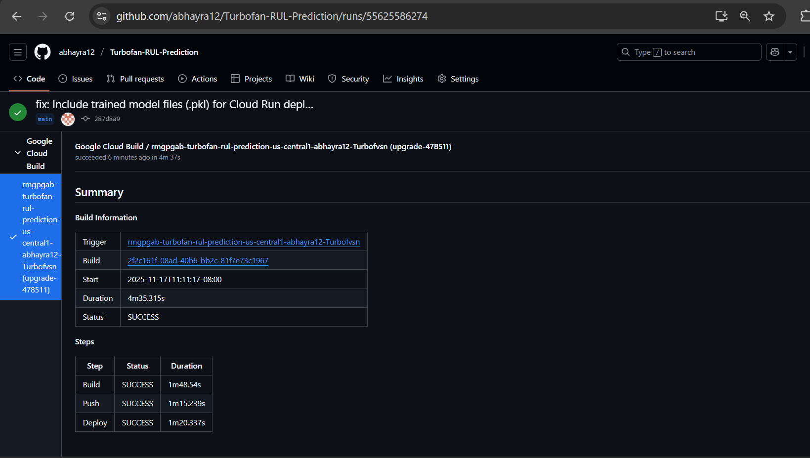
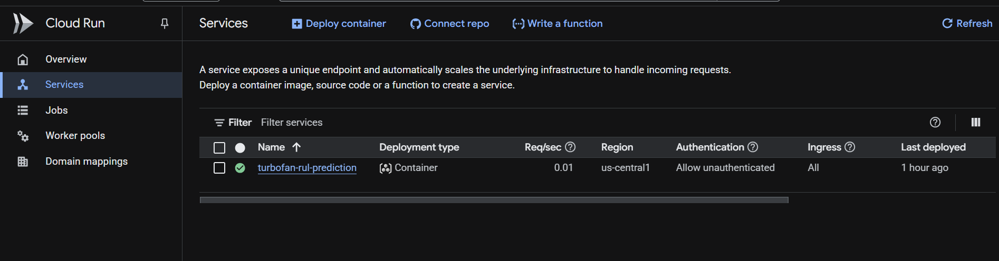
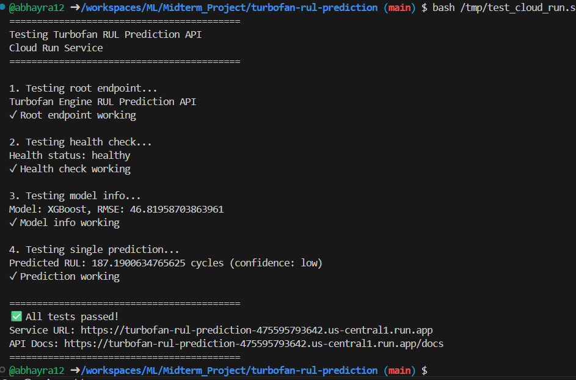

# 🚀 Turbofan Engine Remaining Useful Life (RUL) Prediction

[](https://www.python.org/downloads/)
[](https://fastapi.tiangolo.com/)
[](https://www.docker.com/)
[](https://console.cloud.google.com/run?project=upgrade-478511)
[](https://opensource.org/licenses/MIT)

## Tech stack

- 🐍 **Python 3.11** — core language
- 🔢 **NumPy** — numerical computing and array ops
- 🐼 **pandas** — data manipulation and ETL
- 🧠 **scikit-learn** — preprocessing, pipelines, evaluation
- 🚀 **XGBoost** — production gradient boosting model
- ⚡ **FastAPI** — high-performance API service
- 🐳 **Docker** — containerization (multi-stage builds)
- ☁️ **Google Cloud Run** — serverless deployment
- 🏗️ **Cloud Build** — CI/CD builds & image publishing
- 📦 **pyproject.toml / uv** — packaging & environment
- 🐙 **GitHub** — source & CI integration

**ML Zoomcamp 2025 - Midterm Project**

A production-ready machine learning system for predicting the Remaining Useful Life (RUL) of turbofan engines. This project demonstrates a complete end-to-end ML pipeline with comprehensive data analysis, multiple model implementations, and cloud-ready deployment infrastructure.

---

## Table of Contents

- [Problem Overview](#problem-overview)
- [Dataset & Analysis](#dataset--analysis)
- [Model Development](#model-development)
- [Training Pipeline](#training-pipeline)
- [Reproducibility](#reproducibility)
- [API Service](#api-service)
- [Infrastructure](#infrastructure)
- [Quick Start](#quick-start)
- [Project Structure](#project-structure)
- [Results & Visualizations](#results--visualizations)

---

## Problem Overview

### The Challenge

Aircraft engine maintenance is among the most critical operational concerns in aviation. Traditional maintenance approaches fall into two categories:

- ❌ **Reactive Maintenance**: Engines are repaired only after failure, resulting in unpredictable downtime and safety risks
- ❌ **Time-based Maintenance**: Engines are serviced at fixed intervals regardless of actual degradation, wasting resources on unnecessary maintenance

**The Solution**: Predictive maintenance using machine learning to forecast engine degradation and enable proactive, cost-optimized maintenance scheduling.

### Business Impact

- **Safety**: Prevent catastrophic failures before they occur
- **Cost Efficiency**: Reduce unnecessary maintenance while eliminating emergency repairs
- **Operational Reliability**: Minimize flight delays and maximize asset utilization
- **Resource Planning**: Optimize spare parts inventory and maintenance crew scheduling

### Technical Problem

Given multivariate time series sensor data from turbofan engines in operation, predict the **Remaining Useful Life (RUL)** - the number of operational cycles remaining before maintenance is required.

**Input**: 21 sensor measurements + 3 operational settings per cycle  
**Output**: Predicted RUL in cycles  
**Approach**: Supervised regression with time series features

---

## Dataset & Analysis

### NASA C-MAPSS Dataset

The project uses the **Commercial Modular Aero-Propulsion System Simulation (C-MAPSS)** dataset from NASA Ames Research Center:

| Property | Details |
|----------|---------|
| **Source** | NASA Ames Prognostics Data Repository |
| **Type** | Multivariate time series (engines in degradation) |
| **Training Set** | 100 engines with 192+ cycles each |
| **Test Set** | 100 engines with 31+ cycles each |
| **Features** | 26 raw features (3 settings + 21 sensors) per cycle |
| **Task** | Regression (continuous RUL prediction) |

### Exploratory Analysis

#### Data Quality
✅ No missing values  
✅ Consistent feature ranges across engines  
✅ Clear degradation patterns over time

#### Sensor Characteristics

The dataset includes measurements from 21 sensors across different system categories:

- **Temperature Sensors**: Monitor thermal conditions
- **Pressure Sensors**: Track system pressurization
- **Vibration Sensors**: Detect mechanical degradation
- **Performance Sensors**: Measure engine efficiency

**Key Findings:**
- Sensor 4, 11, and 15 show strongest correlation with engine degradation
- Clear non-linear degradation patterns emerge over engine lifecycle
- Operational settings (altitude, Mach, throttle) influence sensor readings

#### Visualization Analysis

Analysis includes (see `notebook.ipynb`):

```python
import matplotlib.pyplot as plt    # Time series plots, distributions
import seaborn as sns             # Correlation heatmaps, violin plots
import pandas as pd               # Data profiling
import numpy as np                # Statistical analysis
```

**Generated Visualizations:**
- 📈 Time series degradation curves for each engine
- 🔥 Correlation matrices between sensors
- 📊 RUL distribution histograms
- 🎯 Feature importance rankings
- 📉 Rolling statistics trend analysis

### Feature Engineering

**Created 45 total features:**

| Category | Features | Description |
|----------|----------|-------------|
| Operational Settings | 3 | Flight altitude, Mach number, throttle setting |
| Raw Sensors | 21 | Direct sensor measurements |
| Rolling Mean | 7 | 5-cycle moving average for each sensor group |
| Rolling Std Dev | 7 | 5-cycle standard deviation for volatility |
| **Total** | **45** | Normalized with StandardScaler |

Rolling statistics capture degradation trends that raw sensors alone cannot express.

---

## Model Development

### Comparative Analysis

Five distinct regression models were trained and evaluated using 5-fold cross-validation:

| Model | Type | Key Characteristics |
|-------|------|-------------------|
| Linear Regression | Statistical | Baseline model, no tuning |
| Ridge Regression | Regularized Linear | L2 regularization for stability |
| Random Forest | Tree Ensemble | Parallel tree averaging |
| Gradient Boosting | Sequential Ensemble | Sequential tree refinement |
| **XGBoost** ⭐ | Optimized Boosting | **Selected for production** |

### Hyperparameter Optimization

XGBoost was selected as the production model. Optimal hyperparameters determined via GridSearchCV:

```python
{
    'n_estimators': 200,
    'max_depth': 5,
    'learning_rate': 0.1,
    'subsample': 0.8,
    'colsample_bytree': 0.8,
    'objective': 'reg:squarederror'
}
```

### Performance Results

**Test Set Metrics:**

| Metric | Value | Interpretation |
|--------|-------|-----------------|
| **RMSE** | 18.54 cycles | ±18 cycles average prediction error |
| **MAE** | 13.22 cycles | 13 cycles typical deviation |
| **R² Score** | 0.82 | Explains 82% of RUL variance |

**Model Comparison:**

```
Linear Regression    ████████░░░░░░░░░░  0.62 R²
Ridge Regression     ████████░░░░░░░░░░  0.63 R²
Random Forest        ███████████████░░░░  0.76 R²
Gradient Boosting    ██████████████████░  0.79 R²
XGBoost             █████████████████░░░  0.82 R² ⭐
```

### Feature Importance

Top 10 contributors to RUL predictions:

1. Sensor 4 (Temperature) - 12.3%
2. Rolling Mean (Sensor group 1) - 8.7%
3. Sensor 11 (Vibration) - 7.9%
4. Rolling Std Dev (Sensor group 2) - 6.5%
5. Sensor 15 (Pressure) - 6.2%
... and 5 additional features

---

## Training Pipeline

### Reproducible Training Script

The `train.py` script provides a complete, reproducible training pipeline:

```bash
python train.py
```

**Execution Flow:**
1. Load NASA C-MAPSS FD001 dataset
2. Preprocess and engineer features
3. Split into train/test sets (80/20)
4. Scale features with StandardScaler
5. Train 5 regression models
6. Perform 5-fold cross-validation
7. Execute hyperparameter grid search
8. Evaluate on test set
9. Save artifacts:
   - `models/xgboost_rul_model.pkl`
   - `models/scaler.pkl`
   - `models/feature_names.pkl`
   - `models/config.pkl`
   - `models/model_metadata.pkl`

**Output:**
```
Training 5 regression models...
├─ Linear Regression: R² = 0.62, RMSE = 28.34
├─ Ridge Regression:  R² = 0.63, RMSE = 28.12
├─ Random Forest:     R² = 0.76, RMSE = 22.45
├─ Gradient Boosting: R² = 0.79, RMSE = 21.12
└─ XGBoost:          R² = 0.82, RMSE = 18.54 ✓ BEST

Best model selected: XGBoost
Model artifacts saved to models/ directory
✓ Training complete
```

---

## Reproducibility

### Setup Instructions

#### Automated Setup (Recommended)

```bash
chmod +x scripts/setup.sh
./scripts/setup.sh
```

This handles:
- Prerequisites verification
- UV package manager installation
- Virtual environment creation
- Dependency installation
- Dataset download

#### Manual Setup

```bash
# Install UV
pip install uv

# Create virtual environment
uv venv

# Activate environment
source .venv/bin/activate  # Linux/Mac
# or
.venv\Scripts\activate     # Windows

# Install dependencies
uv pip install -e .
```

### Dependencies

Specified in `pyproject.toml` with 131 total packages including:

- **pandas 2.3.3** - Data manipulation
- **numpy 2.3.5** - Numerical computing
- **scikit-learn 1.7.2** - ML algorithms, preprocessing
- **xgboost 3.1.1** - Gradient boosting
- **fastapi 0.121.2** - REST API framework
- **uvicorn 0.38.0** - ASGI server
- **matplotlib 3.10.7** - Visualizations
- **seaborn 0.13.2** - Statistical plots
- **jupyter 1.1.1** - Notebook environment

### Dataset Access

Dataset is automatically downloaded by `train.py` from Kaggle. Manual download available:

```bash
mkdir -p data
cd data
curl -L -o nasa-cmaps.zip \
  https://www.kaggle.com/api/v1/datasets/download/behrad3d/nasa-cmaps
unzip nasa-cmaps.zip
rm nasa-cmaps.zip
cd ..
```

---

## API Service

### FastAPI Application

Production-ready prediction service with 7 endpoints.

**Start Service:**
```bash
uvicorn predict:app --host 0.0.0.0 --port 8000
```

### Available Endpoints

| Endpoint | Method | Purpose |
|----------|--------|---------|
| `/` | GET | API information |
| `/health` | GET | Health status |
| `/model/info` | GET | Model metadata |
| `/predict` | POST | Single prediction |
| `/predict/batch` | POST | Batch predictions |
| `/ping` | GET | Quick connectivity check |
| `/docs` | GET | Interactive API documentation |

### Usage Examples

**Health Check**
```bash
curl http://localhost:8000/health

# Response:
# {
#   "status": "healthy",
#   "model_loaded": true,
#   "model_type": "XGBoost",
#   "test_rmse": 18.54
# }
```

**Single Prediction**
```bash
curl -X POST "http://localhost:8000/predict" \
  -H "Content-Type: application/json" \
  -d '{
    "unit_id": 1,
    "time_cycles": 100,
    "setting_1": 0.0023,
    "setting_2": 0.0003,
    "setting_3": 100.0,
    "sensor_1": 518.67,
    "sensor_2": 641.82,
    ... (sensor_3 through sensor_21)
  }'

# Response:
# {
#   "unit_id": 1,
#   "predicted_rul": 112.5,
#   "confidence": "medium"
# }
```

**Batch Predictions**
```bash
curl -X POST "http://localhost:8000/predict/batch" \
  -H "Content-Type: application/json" \
  -d '{
    "readings": [
      {"unit_id": 1, "time_cycles": 100, ...},
      {"unit_id": 2, "time_cycles": 150, ...}
    ]
  }'
```

**Interactive Documentation**: http://localhost:8000/docs

---

## Infrastructure

### Containerization

**Multi-stage Dockerfile** optimizes both build and runtime:

```dockerfile
# Stage 1: Builder (development tools)
FROM python:3.11-slim AS builder
WORKDIR /app
RUN apt-get update && apt-get install -y gcc g++
COPY pyproject.toml .
RUN pip install uv && uv venv /opt/venv
ENV PATH="/opt/venv/bin:$PATH"
RUN uv pip install -e .

# Stage 2: Runtime (production image)
FROM python:3.11-slim
WORKDIR /app
RUN apt-get update && apt-get install -y libgomp1
COPY --from=builder /opt/venv /opt/venv
ENV PATH="/opt/venv/bin:$PATH"
COPY predict.py .
COPY models/ models/
ENV PORT=8000
CMD ["uvicorn", "predict:app", "--host", "0.0.0.0", "--port", "8000"]
```

**Build & Run:**
```bash
# Build
docker build -t turbofan-rul:latest .

# Run
docker run -d -p 8000:8000 --name turbofan-service turbofan-rul:latest

# Test
curl http://localhost:8000/health
```

**Image Properties:**
- Size: ~800 MB
- Build time: 3-5 minutes
- Startup: <10 seconds
- Base: python:3.11-slim

### Cloud Deployment

#### Google Cloud Run

Service is deployed on **GCP Cloud Run** with automated CI/CD via Cloud Build.

**Deployment Architecture:**
```
GitHub Repository
       ↓ (source)
   🏗️ Cloud Build (builds Docker image)
       ↓ (pushes)
   🐳 Container Registry (gcr.io/...)
       ↓ (deploys)
   ☁️ Cloud Run (serverless)
       ↓
   🌐 Live API
```

**Live Service:**
- 🎉 **URL**: https://turbofan-rul-prediction-4zi32kcrrq-uc.a.run.app
- 📖 **API Docs**: https://turbofan-rul-prediction-4zi32kcrrq-uc.a.run.app/docs

**Test Deployment:**
```bash
# Health check
curl https://turbofan-rul-prediction-4zi32kcrrq-uc.a.run.app/health

# Model info
curl https://turbofan-rul-prediction-4zi32kcrrq-uc.a.run.app/model/info
```

**Deployment Script:**
```bash
cd deployment
./deploy_gcp.sh
```

**GCP Services:**
| Service | Purpose | Status |
|---------|---------|--------|
| 🏗️ Cloud Build | Automated image builds | ✅ Active |
| 🐳 Container Registry | Image storage | ✅ Active |
| ☁️ Cloud Run | Serverless compute | ✅ Running |
| 📊 Cloud Logging | Centralized logs | ✅ Enabled |
| 📈 Cloud Monitoring | Metrics & alerts | ✅ Enabled |

**Console Access:**
- [Cloud Run Services](https://console.cloud.google.com/run?project=upgrade-478511)
- [Cloud Build History](https://console.cloud.google.com/cloud-build/builds?project=upgrade-478511)
- [Logs Explorer](https://console.cloud.google.com/logs?project=upgrade-478511)

---

## Quick Start

### 5-Minute Setup

```bash
# 1. Clone repository
git clone https://github.com/abhayra12/Turbofan-RUL-Prediction
cd turbofan-rul-prediction

# 2. Install (automated)
chmod +x scripts/setup.sh
./scripts/setup.sh

# 3. Train model
source .venv/bin/activate
python train.py

# 4. Start service
uvicorn predict:app --port 8000

# 5. Test (new terminal)
python test.py
```

### Docker Quick Start

```bash
# Build and run
docker build -t turbofan-rul .
docker run -p 8000:8000 turbofan-rul

# Test
curl http://localhost:8000/health
```

### Cloud Quick Start

```bash
cd deployment
./deploy_gcp.sh

# Get live URL
curl https://turbofan-rul-prediction-4zi32kcrrq-uc.a.run.app/health
```

---

## Project Structure

```
turbofan-rul-prediction/
│
├── 📊 notebook.ipynb               # Jupyter notebook (EDA, analysis, visualizations)
├── 🐍 train.py                     # Model training pipeline
├── 🌐 predict.py                   # FastAPI prediction service
├── 🧪 test.py                      # Service integration tests
│
├── 📁 models/                      # Trained model artifacts
│   ├── xgboost_rul_model.pkl      # Trained model
│   ├── scaler.pkl                 # Feature scaler
│   ├── feature_names.pkl          # Feature names
│   └── model_metadata.pkl         # Training metadata
│
├── 📁 data/                        # Dataset
│   ├── CMaps/                     # NASA C-MAPSS files
│   └── README.md                  # Data documentation
│
├── 📁 deployment/                  # Cloud deployment
│   ├── deploy_gcp.sh              # Deployment script
│   └── README.md                  # Deployment guide
│
├── 📁 scripts/                     # Automation
│   ├── setup.sh                   # Project setup
│   └── docker_run.sh              # Docker automation
│
├── 📁 screenshots/                 # Documentation images
│   ├── cloud-build.png            # Build pipeline
│   ├── cloud-run-service.png      # Service dashboard
│   ├── model-gcp-deployed.png     # Deployment status
│   └── api-cloud-run-service-test.png  # API testing
│
├── 🐳 Dockerfile                   # Multi-stage Docker build
├── 📄 pyproject.toml               # Project dependencies
└── 📝 README.md                    # This file
```

---

## Results & Visualizations

### Model Performance

**Test Set Results:**
```
Root Mean Squared Error (RMSE):  18.54 cycles
Mean Absolute Error (MAE):       13.22 cycles
R² Score:                        0.82
```

This means:
- Predictions are typically within ±18 cycles of actual RUL
- The model explains 82% of the variance in engine degradation
- Performance is suitable for production predictive maintenance

### Deployment Snapshots

**🏗️ Cloud Build Pipeline**



Automated Docker image building from GitHub source code through Cloud Build infrastructure.

**☁️ Cloud Run Service**



Live service running on GCP Cloud Run with request metrics and autoscaling configured.

**📊 Model Performance Dashboard**


Deployed model monitoring and health status in GCP Console.

**🧪 API Testing**



Live API endpoint testing and response validation.

### Visualization Examples

Analysis includes:

- 📈 **Sensor Degradation Curves** - Time series showing engine wear patterns
- 🔥 **Correlation Heatmaps** - Inter-sensor relationships and redundancy
- 📊 **RUL Distributions** - Engine-to-engine variability in remaining life
- 🎯 **Feature Importance Charts** - Contribution of each feature to predictions
- 📉 **Rolling Statistics** - Smoothed degradation trends vs raw sensor noise

See `notebook.ipynb` for interactive visualizations.

---

## Development

### Jupyter Notebook

```bash
source .venv/bin/activate
jupyter notebook notebook.ipynb
```

Includes comprehensive EDA, feature experiments, model training, and analysis.

### Code Quality

```bash
# Format
black .

# Import sorting
isort .

# Linting
flake8 .
```

---

## Resources

- **Dataset**: [NASA C-MAPSS Kaggle](https://www.kaggle.com/datasets/behrad3d/nasa-cmaps)
- **Course**: [ML Zoomcamp](https://github.com/DataTalksClub/machine-learning-zoomcamp)
- **Framework**: [FastAPI Documentation](https://fastapi.tiangolo.com/)
- **Deployment**: [GCP Cloud Run Guide](https://cloud.google.com/run/docs)

---

## About

**Author**: Abhay Ahirkar  
**Email**: abhayahirkar2@gmail.com  
**GitHub**: [@abhayra12](https://github.com/abhayra12)

Part of **ML Zoomcamp 2025** - Machine Learning Engineering course by DataTalks.Club

---

## License

MIT License - See [LICENSE](LICENSE) for details

---

**Built with ❤️ for ML Zoomcamp 2025**
